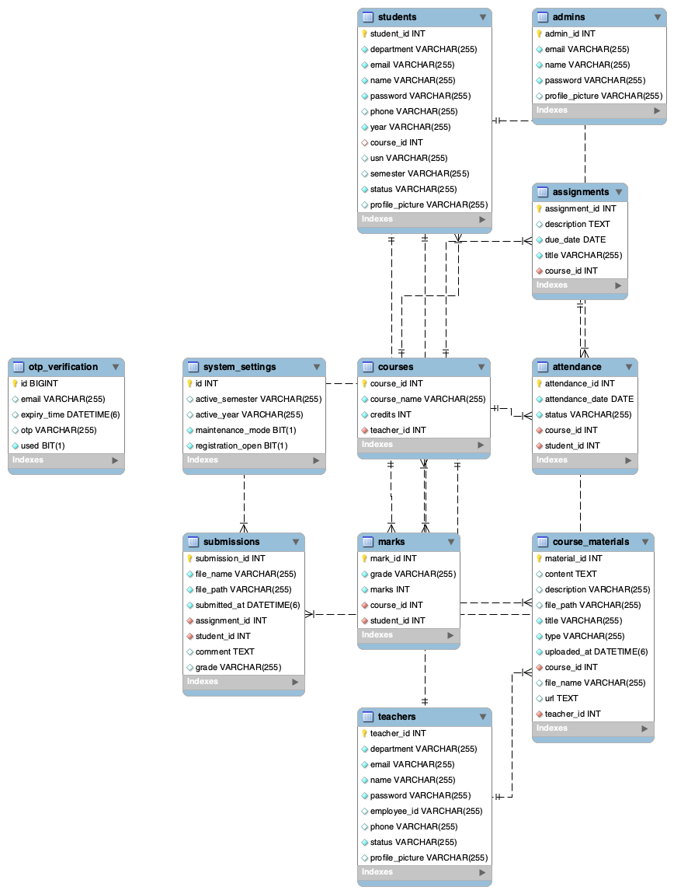

# EduTrack — Database Schema Document

**Project:** EduTrack Academic Management Platform  
**Team:** VTU Internship 2026 — Team 15  
**Database:** MySQL 9.4  
**Date:** April 2026

---

## ER Diagram

---

## Overview

The EduTrack database consists of **11 tables** organized around three core user types — Students, Teachers, and Admins — with supporting tables for academic data management.

### Tables Summary

| Table | Description |
|---|---|
| admins | Administrator accounts |
| teachers | Teacher accounts and profiles |
| students | Student accounts and profiles |
| courses | Courses created by teachers |
| attendance | Attendance records per student per course |
| assignments | Assignments created for courses |
| submissions | Student assignment submissions |
| marks | Student marks and grades per course |
| course_materials | Study materials uploaded by teachers |
| otp_verification | OTP records for password reset |
| system_settings | Platform-wide configuration |

---

## Table Definitions

### 1. admins

Stores administrator account information. Auto-seeded with a default admin on first startup.

| Column | Data Type | Constraints | Description |
|---|---|---|---|
| admin_id | INT | PK, AUTO_INCREMENT | Unique admin identifier |
| name | VARCHAR(100) | NOT NULL | Admin full name |
| email | VARCHAR(100) | NOT NULL, UNIQUE | Admin email address |
| password | VARCHAR(255) | NOT NULL | BCrypt hashed password |

---

### 2. teachers

Stores teacher account and profile information.

| Column | Data Type | Constraints | Description |
|---|---|---|---|
| teacher_id | INT | PK, AUTO_INCREMENT | Unique teacher identifier |
| name | VARCHAR(100) | NOT NULL | Teacher full name |
| email | VARCHAR(100) | NOT NULL, UNIQUE | Teacher email address |
| password | VARCHAR(255) | NOT NULL | BCrypt hashed password |
| phone | VARCHAR(15) | NULLABLE | Contact number |
| department | VARCHAR(100) | NOT NULL | Department name |
| employee_id | VARCHAR(50) | UNIQUE, NULLABLE | Employee ID |
| status | VARCHAR(20) | DEFAULT 'Active' | Active / Suspended |

---

### 3. students

Stores student account and academic profile information.

| Column | Data Type | Constraints | Description |
|---|---|---|---|
| student_id | INT | PK, AUTO_INCREMENT | Unique student identifier |
| name | VARCHAR(100) | NOT NULL | Student full name |
| email | VARCHAR(100) | NOT NULL, UNIQUE | Student email address |
| password | VARCHAR(255) | NOT NULL | BCrypt hashed password |
| phone | VARCHAR(15) | NULLABLE | Contact number |
| usn | VARCHAR(50) | UNIQUE, NULLABLE | University Seat Number |
| department | VARCHAR(100) | NOT NULL | Department name |
| year | VARCHAR(20) | NOT NULL | Academic year (e.g. 3rd Year) |
| semester | VARCHAR(20) | NULLABLE | Semester (e.g. Sem 5) |
| status | VARCHAR(20) | DEFAULT 'Active' | Active / Suspended / Graduated |
| course_id | INT | FK → courses, NULLABLE | Enrolled course |

---

### 4. courses

Stores courses created and managed by teachers.

| Column | Data Type | Constraints | Description |
|---|---|---|---|
| course_id | INT | PK, AUTO_INCREMENT | Unique course identifier |
| course_name | VARCHAR(150) | NOT NULL | Name of the course |
| credits | INT | DEFAULT 3 | Credit hours |
| teacher_id | INT | FK → teachers (CASCADE) | Assigned teacher |

**Relationships:**
- Many courses can belong to one teacher
- Deleting a teacher cascades to delete all their courses

---

### 5. attendance

Records daily attendance for each student in each course.

| Column | Data Type | Constraints | Description |
|---|---|---|---|
| attendance_id | INT | PK, AUTO_INCREMENT | Unique attendance record |
| student_id | INT | FK → students (CASCADE) | Student reference |
| course_id | INT | FK → courses (CASCADE) | Course reference |
| attendance_date | DATE | NOT NULL | Date of attendance |
| status | VARCHAR(10) | DEFAULT 'Present' | Present / Absent |

**Relationships:**
- Each record links one student to one course on one date
- Supports upsert — updating existing record if same student+course+date exists

---

### 6. assignments

Stores assignments created by teachers for their courses.

| Column | Data Type | Constraints | Description |
|---|---|---|---|
| assignment_id | INT | PK, AUTO_INCREMENT | Unique assignment identifier |
| course_id | INT | FK → courses (CASCADE) | Course reference |
| title | VARCHAR(200) | NOT NULL | Assignment title |
| description | TEXT | NULLABLE | Assignment details |
| due_date | DATE | NOT NULL | Submission deadline |

---

### 7. submissions

Records student submissions for assignments.

| Column | Data Type | Constraints | Description |
|---|---|---|---|
| submission_id | INT | PK, AUTO_INCREMENT | Unique submission identifier |
| assignment_id | INT | FK → assignments (CASCADE) | Assignment reference |
| student_id | INT | FK → students (CASCADE) | Student reference |
| submitted_at | DATETIME | NOT NULL | Submission timestamp |
| file_url | VARCHAR(500) | NULLABLE | Uploaded file URL |
| status | VARCHAR(20) | DEFAULT 'Submitted' | Submission status |
| grade | VARCHAR(10) | NULLABLE | Grade given by teacher |
| feedback | TEXT | NULLABLE | Teacher feedback |

---

### 8. marks

Stores marks and auto-calculated grades for students per course.

| Column | Data Type | Constraints | Description |
|---|---|---|---|
| mark_id | INT | PK, AUTO_INCREMENT | Unique mark record |
| student_id | INT | FK → students (CASCADE) | Student reference |
| course_id | INT | FK → courses (CASCADE) | Course reference |
| marks | INT | DEFAULT 0 | Marks scored |
| grade | VARCHAR(5) | DEFAULT 'N/A' | Auto-calculated grade |

**Grading Logic:**

| Marks | Grade |
|---|---|
| 90 – 100 | O |
| 80 – 89 | A+ |
| 70 – 79 | A |
| 60 – 69 | B+ |
| Below 60 | B |

---

### 9. course_materials

Stores study materials uploaded by teachers for their courses.

| Column | Data Type | Constraints | Description |
|---|---|---|---|
| material_id | INT | PK, AUTO_INCREMENT | Unique material identifier |
| course_id | INT | FK → courses (CASCADE) | Course reference |
| title | VARCHAR(200) | NOT NULL | Material title |
| material_url | VARCHAR(500) | NOT NULL | File or link URL |
| uploaded_at | DATETIME | NOT NULL | Upload timestamp |

---

### 10. otp_verification

Stores OTP records for password reset. Standalone table — no foreign keys.

| Column | Data Type | Constraints | Description |
|---|---|---|---|
| id | BIGINT | PK, AUTO_INCREMENT | Unique OTP record |
| email | VARCHAR(100) | NOT NULL | Email OTP was sent to |
| otp | VARCHAR(6) | NOT NULL | 6-digit OTP code |
| expiry_time | DATETIME | NOT NULL | Expiry (10 min from creation) |
| used | BOOLEAN | DEFAULT FALSE | Whether OTP has been used |

**Notes:**
- No foreign key to students/teachers/admins — serves all three roles via email lookup
- Old OTPs are deleted before generating a new one
- OTP is marked `used=true` after successful verification (single-use)

---

### 11. system_settings

Stores platform-wide configuration. Always has exactly one row (id=1).

| Column | Data Type | Constraints | Description |
|---|---|---|---|
| id | INT | PK | Fixed value: 1 |
| active_year | VARCHAR(20) | NOT NULL | Current academic year (e.g. 2025-26) |
| active_semester | VARCHAR(20) | NOT NULL | Current semester (e.g. Even) |
| maintenance_mode | BOOLEAN | DEFAULT FALSE | Blocks student/teacher login when true |
| registration_open | BOOLEAN | DEFAULT TRUE | Allows/blocks student self-registration |

---

## Relationships Summary

| Relationship | Type | Details |
|---|---|---|
| teachers → courses | One to Many | One teacher has many courses |
| courses → attendance | One to Many | One course has many attendance records |
| students → attendance | One to Many | One student has many attendance records |
| courses → assignments | One to Many | One course has many assignments |
| assignments → submissions | One to Many | One assignment has many submissions |
| students → submissions | One to Many | One student has many submissions |
| courses → marks | One to Many | One course has many mark records |
| students → marks | One to Many | One student has many mark records |
| courses → course_materials | One to Many | One course has many materials |

---

## Cascade Delete Rules

| Delete Action | Cascades To |
|---|---|
| Delete teacher | Deletes all their courses, attendance, marks, assignments, submissions, materials |
| Delete student | Deletes all their attendance, marks, submissions |
| Delete course | Deletes all attendance, marks, assignments, submissions, materials for that course |
| Delete assignment | Deletes all submissions for that assignment |

---

*EduTrack — VTU Internship 2026, Team 15*
