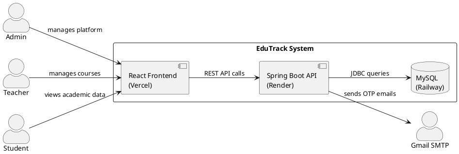
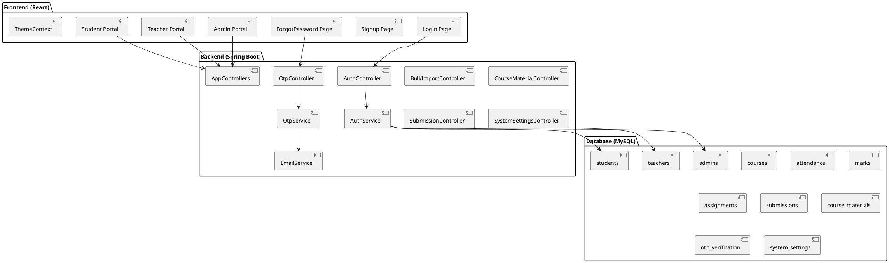
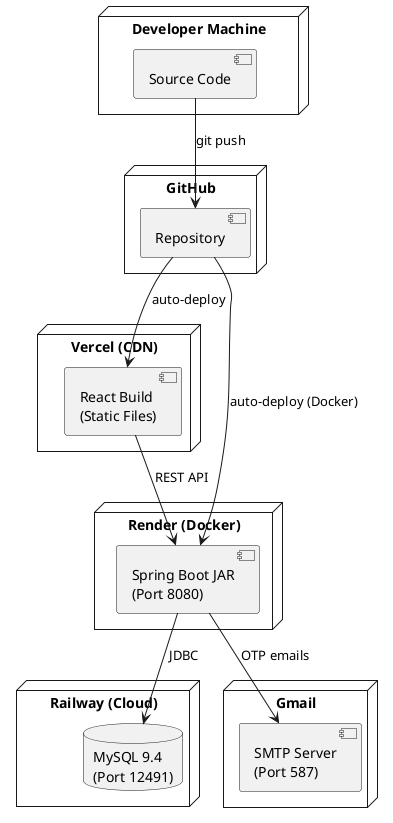
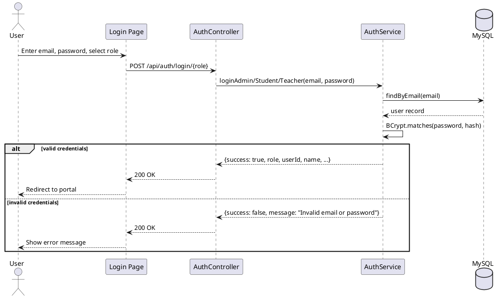
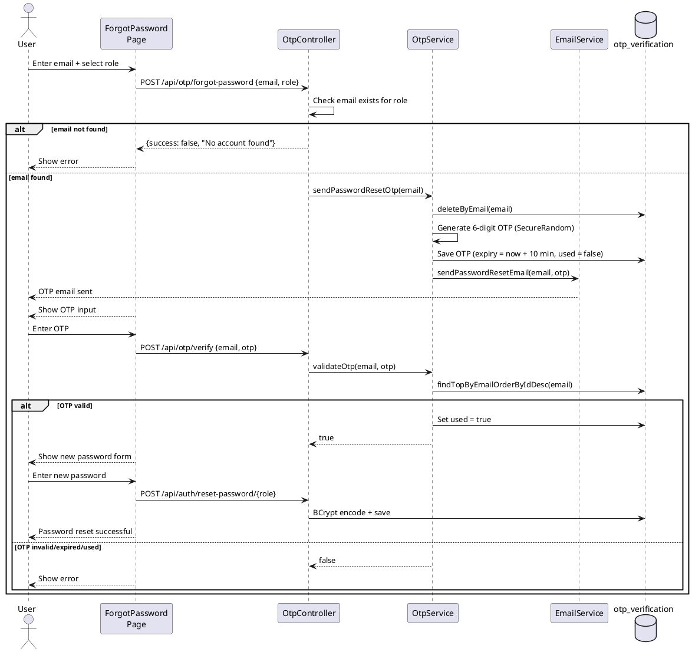
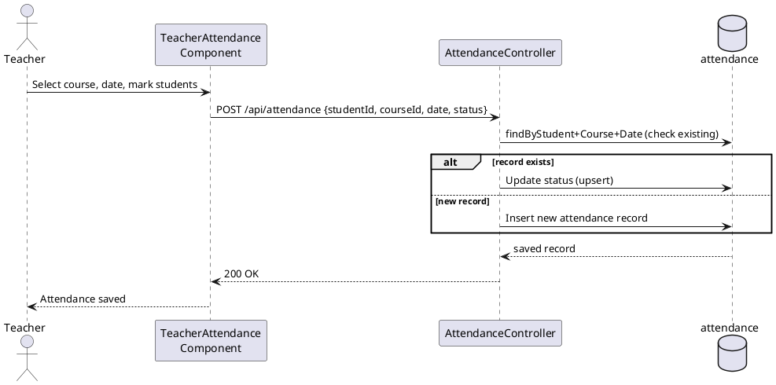
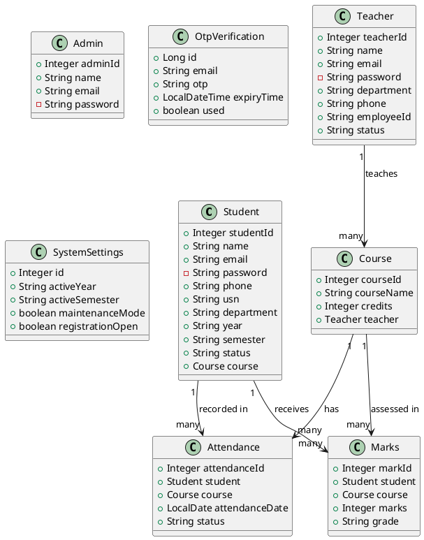

# EduTrack — High Level Design (HLD) & Low Level Design (LLD)

**Project:** EduTrack Academic Management Platform  
**Team:** VTU Internship 2026 — Team 15  
**Version:** 1.0  
**Date:** April 2026

---

# PART 1 — HIGH LEVEL DESIGN (HLD)

---

## 1. System Architecture

EduTrack follows a 3-tier architecture:

```
┌─────────────────────────────────────────────────────────┐
│                  PRESENTATION LAYER                      │
│              React 19 (Vercel CDN)                       │
│   Admin Portal | Teacher Portal | Student Portal         │
└─────────────────────┬───────────────────────────────────┘
                      │ HTTPS REST API (JSON)
┌─────────────────────▼───────────────────────────────────┐
│                  BUSINESS LOGIC LAYER                    │
│           Spring Boot 3 (Render - Docker)                │
│   Controllers → Services → Repositories                  │
└─────────────────────┬───────────────────────────────────┘
                      │ JDBC (HikariCP Connection Pool)
┌─────────────────────▼───────────────────────────────────┐
│                    DATA LAYER                            │
│              MySQL 9.4 (Railway Cloud)                   │
│              11 Tables, Foreign Keys                     │
└─────────────────────────────────────────────────────────┘
```

---

## 2. System Context Diagram

Paste at https://www.plantuml.com/plantuml/uml to generate:



---

## 3. Component Diagram



---

## 4. Deployment Diagram



---

## 5. Authentication Flow Diagram



---

## 6. OTP Password Reset Flow Diagram



---

## 7. Mark Attendance Flow



---

---

# PART 2 — LOW LEVEL DESIGN (LLD)

---

## 8. Entity Class Diagram



---

## 9. Correct Entity Code

### 9.1 Student Entity (Actual)

```java
@Entity
@Table(name = "students")
@Data @NoArgsConstructor @AllArgsConstructor
public class Student {

    @Id
    @GeneratedValue(strategy = GenerationType.IDENTITY)
    private Integer studentId;

    @Column(nullable = false)
    private String name;

    @Column(nullable = false, unique = true)
    private String email;

    @JsonProperty(access = JsonProperty.Access.WRITE_ONLY)
    @Column(nullable = false)
    private String password;

    private String phone;

    @Column(unique = true)
    private String usn;

    @Column(nullable = false)
    private String department;

    @Column(nullable = false)
    private String year;

    private String semester;

    @Column(nullable = false)
    private String status = "Active"; // Active, Suspended, Graduated

    @ManyToOne
    @JoinColumn(name = "course_id")
    private Course course;
}
```

### 9.2 Teacher Entity (Actual)

```java
@Entity
@Table(name = "teachers")
@Data @NoArgsConstructor @AllArgsConstructor
public class Teacher {

    @Id
    @GeneratedValue(strategy = GenerationType.IDENTITY)
    private Integer teacherId;

    @Column(nullable = false)
    private String name;

    @Column(nullable = false, unique = true)
    private String email;

    @JsonProperty(access = JsonProperty.Access.WRITE_ONLY)
    @Column(nullable = false)
    private String password;

    @Column(nullable = false)
    private String department;

    private String phone;

    @Column(unique = true)
    private String employeeId;

    @Column(nullable = false)
    private String status = "Active"; // Active, Suspended
}
```

### 9.3 Attendance Entity (Actual)

```java
@Entity
@Table(name = "attendance",
    uniqueConstraints = @UniqueConstraint(
        columnNames = {"student_id","course_id","attendance_date"}))
@Data @NoArgsConstructor @AllArgsConstructor
public class Attendance {

    @Id
    @GeneratedValue(strategy = GenerationType.IDENTITY)
    private Integer attendanceId;

    @ManyToOne
    @JoinColumn(name = "student_id", nullable = false)
    private Student student;

    @ManyToOne
    @JoinColumn(name = "course_id", nullable = false)
    private Course course;

    @Column(nullable = false)
    private LocalDate attendanceDate;

    @Column(nullable = false)
    private String status; // Present or Absent
}
```

---

## 10. Service Method Design

### 10.1 AuthService.loginAdmin()

```
Input:  email: String, password: String
Output: Map<String, Object>

Steps:
  1. adminRepo.findByEmail(email)
  2. If empty OR !BCrypt.matches(password, hash) → {success:false}
  3. Build response: {success:true, adminId, name, email, role:"admin"}
  4. Return response
```

### 10.2 OtpService.validateOtp()

```
Input:  email: String, otp: String
Output: boolean

Steps:
  1. otpRepo.findTopByEmailOrderByIdDesc(email)
  2. If empty → return false
  3. If otpEntity.isUsed() → return false
  4. If otpEntity.expiryTime.isBefore(now) → return false
  5. If !otpEntity.otp.equals(otp) → return false
  6. otpEntity.setUsed(true) → otpRepo.save()
  7. Return true
```

### 10.3 MarksController.enterMarks()

```
Input:  Marks {student, course, marks}
Output: Marks with grade

Grade calculation:
  marks >= 90 → "O"
  marks >= 80 → "A+"
  marks >= 70 → "A"
  marks >= 60 → "B+"
  else        → "B"
```

---

## 11. Repository Methods

### 11.1 StudentRepository

```java
Optional<Student> findByEmail(String email);
boolean existsByEmail(String email);
Optional<Student> findByUsn(String usn);
List<Student> findByDepartmentIgnoreCase(String department);
```

### 11.2 AttendanceRepository

```java
List<Attendance> findByStudent_StudentId(Integer studentId);
List<Attendance> findByCourse_CourseId(Integer courseId);
List<Attendance> findByCourse_CourseIdAndAttendanceDate(Integer courseId, LocalDate date);
Optional<Attendance> findByStudent_StudentIdAndCourse_CourseIdAndAttendanceDate(
    Integer studentId, Integer courseId, LocalDate date);
void deleteByStudent_StudentId(Integer studentId);
void deleteByCourse_CourseId(Integer courseId);
```

### 11.3 OtpRepository

```java
Optional<OtpVerification> findTopByEmailOrderByIdDesc(String email);
void deleteByEmail(String email);
```

---

## 12. Security Configuration

```java
@Bean
public SecurityFilterChain filterChain(HttpSecurity http) throws Exception {
    http
        .csrf(csrf -> csrf.disable())
        .cors(cors -> cors.configurationSource(corsConfigurationSource()))
        .authorizeHttpRequests(auth -> auth
            .anyRequest().permitAll()
        );
    return http.build();
}

@Bean
public CorsConfigurationSource corsConfigurationSource() {
    CorsConfiguration config = new CorsConfiguration();
    config.setAllowedOriginPatterns(List.of("*"));
    config.setAllowedMethods(List.of("GET","POST","PUT","DELETE","OPTIONS"));
    config.setAllowedHeaders(List.of("*"));
    config.setAllowCredentials(true);
    // ...
}
```

---

*EduTrack — VTU Internship 2026, Team 15*
